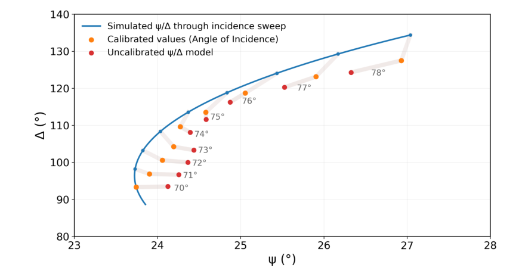

# Nanophysics Group Project

**Rotating-compensator ellipsometry, thin films and surface plasmon resonance**

I led an **eight-person experimental nanophysics project**, coordinating fabrication, profilometry, ellipsometry and surface-plasmon measurements. My technical work focused on the ellipsometry modelling, Ψ–Δ extraction and instrument calibration.

**71% group mark · 75% individual mark | First Class**

[Read the project report](https://1drv.ms/b/c/4a8cd531de3d2eb8/IQDELQqEGltQTbL7tnMde-ugARVe41tXLblHZuhFeltOyTY?e=aEIhof)

## Results

*Silicon-oxide reference measurements before and after calibration, compared with the predicted incidence sweep.*

Compared with previous-year implementations, the improved optical setup and analysis tracked **Ψ and Δ approximately 25× more closely**. I developed a custom instrument calibration that reduced the remaining tracking error by approximately a **further factor of two**.

The calibration was derived from a silicon-oxide reference, checked across the measured incidence-angle sweep and carried forward to the gold and silver measurements. The silicon-reference analysis approached nanometre precision with **55 ± 7 nm** for film thickness, compared with the certified **53.3 nm**. An independent industrial ellipsometer provided a further comparison. The report discusses the residual Δ offset and the variation in accuracy with incidence angle.

## My contribution

I developed the Ψ–Δ extraction methodology and silicon-reference calibration, connected the analysis stages, and checked the recovered parameters against reference measurements. I also contributed to the Fresnel, Jones-matrix and harmonic intensity models and worked on silicon-oxide, silver-film and gold-film analysis.

As project leader, I coordinated experimental priorities, milestones and technical discussions between the measurement groups. For example this includes sample fabrication consistency for comparison of RCE with profileometry.

## Methods

The workflow converts RCE intensity sweeps into thin-film properties through preprocessing, harmonic fitting, instrument calibration, Ψ–Δ extraction and Fresnel–Airy modelling.

A measured detector dark signal is subtracted before normalisation. The extraction then fits Ψ, Δ and positive gain with the detector offset fixed at zero. Allowing an additional free offset can make those quantities impossible to determine uniquely from one waveform.

Film fitting estimates thickness, real refractive index and extinction coefficient. A single Ψ–Δ pair supplies only two measured quantities, so the current three-parameter fit combines at least two distinct incidence angles of the same film. Additional angles, sensible parameter bounds and different starting guesses help examine whether the fit is unique.

Fits give weights to Ψ and Δ in degrees based on the proximity to the brewsters angle. The covariance estimates describe local uncertainty conditional on the optical model and calibration. They do not include surface roughness, thickness variation, incidence-angle error, reference uncertainty or propagated calibration uncertainty. 

The Jacobian condition number is recorded as a diagnostic, with interpretation dependent on parameter units and scaling. Wobble and retardance remain fixed by default; additional instrument parameters require reference data that can determine them. I determined these instrument parameters by taking data with no sample present.

The current modules provide a reusable physical instrument model and joint film fitting. The report documents the empirical calibration used in the original experiment.

## Measurements and analysis files

Measurement files contain two numeric columns: compensator angle in degrees and intensity. For a single measurement 180 data points are collected over a single rotation. Numeric metadata embedded in prose is ignored, zero readings are retained, and the sample count is checked after any explicit filtering.

 The angle can also be supplied directly to `build_sweep`. Measurements combined in one film fit must have the same sample name and belong to the same physical film.

| Folder | Contents |
| --- | --- |
| `analysis/` | Harmonic fitting, instrument model, calibration, Ψ–Δ extraction, Fresnel modelling, film fitting and the connected workflow |
| `processing/` | Measurement import, normalisation, plotting and output tables |

**Tools:** Python, NumPy, SciPy, pandas and Matplotlib.
